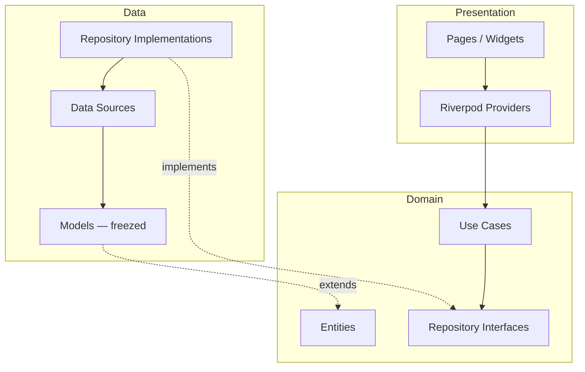

# Flutter Starter

A production-ready Flutter starter project using **Clean Architecture** with feature-first organization.

## Architecture



**Dependency Rule**: outer layers depend on inner layers, never the reverse. Domain has zero framework imports.

## Tech Stack

| Concern | Choice |
|---------|--------|
| State Management | Riverpod + riverpod_generator |
| Navigation | go_router |
| Networking | Dio |
| Data Models | freezed + json_serializable |
| Code Gen | build_runner |
| Testing | flutter_test + mocktail |

## Project Structure

```
lib/
├── app/                  # App widget, router, environment config
├── core/                 # Shared infrastructure (network, theme)
├── features/             # Feature modules (auth, ...)
│   └── auth/
│       ├── data/         # Repositories impl, data sources, models
│       ├── domain/       # Entities, use cases, repository interfaces
│       └── presentation/ # Pages, widgets, providers
├── shared/               # Shared widgets & utilities
├── main_dev.dart         # Dev entry point
├── main_staging.dart     # Staging entry point
└── main_prod.dart        # Production entry point
```

## Setup

### Prerequisites

- Flutter 3.27+ / Dart 3.6+
- Android SDK (minSdk 24) or Xcode (iOS 15.0+)

### Install dependencies

```bash
flutter pub get
```

### Generate code

```bash
make gen
# or for watch mode:
make watch
```

### Setup Lefthook (pre-commit hooks)

```bash
dart pub global activate lefthook
lefthook install
```

## Running

Each flavor has its own entry point and `.env` file:

```bash
# Development
flutter run --target lib/main_dev.dart

# Staging
flutter run --target lib/main_staging.dart

# Production
flutter run --target lib/main_prod.dart
```

## Testing

```bash
# Run all tests
make test

# Run analysis
make analyze

# Check formatting
make format
```

## CI/CD

GitHub Actions workflow (`.github/workflows/ci.yml`) runs:

1. **Analyze & Format** — static analysis + formatting check
2. **Test** — runs all tests with coverage
3. **Build Android** — release APK
4. **Build iOS** — release build (no codesign)

## Common Commands

| Command | Description |
|---------|-------------|
| `make gen` | Run build_runner code generation |
| `make watch` | Run build_runner in watch mode |
| `make test` | Run tests with coverage |
| `make analyze` | Static analysis |
| `make format` | Check formatting |
| `make clean` | Clean build artifacts |
| `make check` | Run analyze + format (CI-style) |
